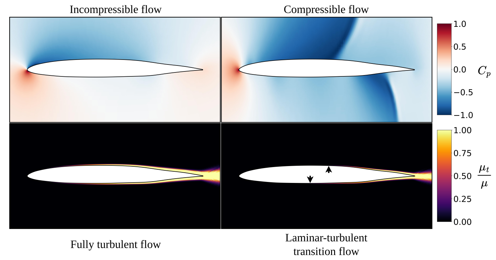

**UniFoil** is a Universal Dataset of Airfoils in Transitional and Turbulent Regimes for Subsonic and Transonic Flows for Machine Learning.
It consists of 500,000 simulations covering transitional and fully turbulent flows across incompressible to compressible regimes for 2D airfoils.
UniFoil features include the following:
- 400,000 fully-turbulent (FT) airfoil simulations
- 50,000 natural laminar flow (NLF) airfoil simulations in fully turbulent regime
- 50,000 NLF airfoil simulations in the transition regime.

<p align="center">
  
</p>

The dataset can be found here - https://doi.org/10.7910/DVN/VQGWC4

## Repository Contents
This repository contains supplementary data and code for dat extraction and visualization purposes to help end-users better analysze the dataset.
In the main-directory, we have the following folders
- Airfoil_Generator_Code : Contains all the data for modal-based sampling of the airfoil shapes.
- Data_Extract_and_Visualize : Contains useful code to aid data extraction, manipulation and visualization.
- Machine Learning : Contains code for the neural network training that was successfully trained on the FT-airfoil dataset.
- Images : Some results from the paper.

Each folder contains its own **README.md** file to aid better understanding of information and code.

<p align="center">
  
</p>

## Python packages requirements
The following python packages are necessary for smooth working of the codes in this repository:
- Tensorflow
- Scikit-learn
- Numpy
- Matplotlib
- PyVista
- Nvidia Cuda Drivers (Optional, for speed)

### Install all using pip:

```html
pip
```
## License

Distributed using the **CC BY-SA** license, version 4.0; \
Please see the LICENSE file for details.

## Citing UniFoil

If you use UniFoil, please cite:

```bibtex
@misc{UniFoil,
  doi = {10.7910/DVN/VQGWC4},
  url = {https://dataverse.harvard.edu/citation?persistentId=doi:10.7910/DVN/VQGWC4},
  author = {Kanchi, Rohit; Melanson, Benjamin; Somasekharan, Nithin; Pan, Shaowu; He, Sicheng},
  keywords = {Engineering, Computer and Information Science, Physics},
  title = {UniFoil},
  publisher = {Harvard Dataverse},
  year = {2025}
}
